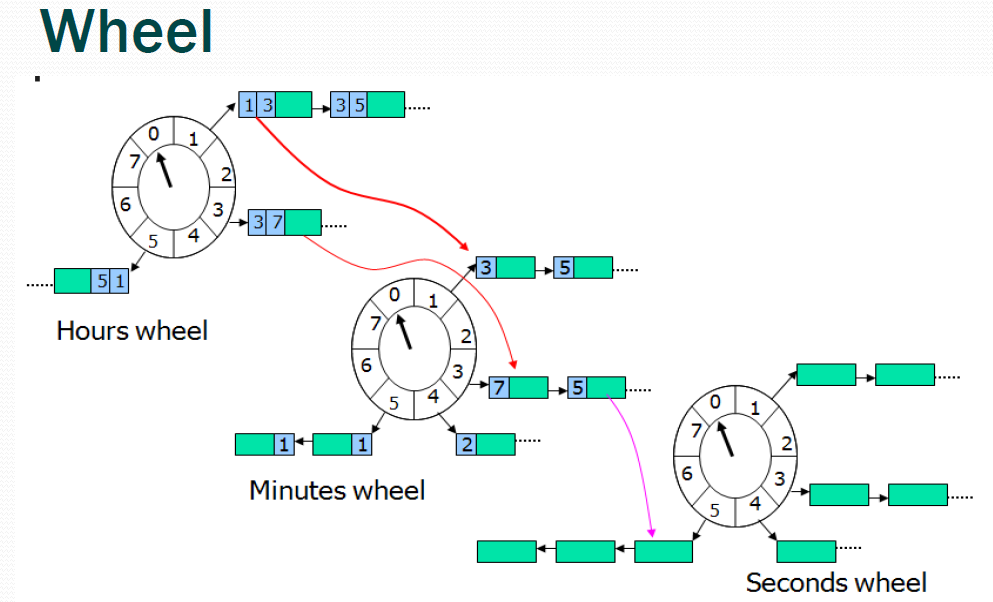

# go-timer-wheel

基于时间轮的任务超时调度库


=========================
安装方式
```go
package main


import (
        "fmt"
        github.com/zhangwei1234/go-timer-wheel/timerWheel"
)

func main() {
    wheel := timerWheel.NewTimerWheel()//初始化
	wheel.Start()//启动
	wheel.AddTask(&MyTask{}, 4 * time.Second)
}

type MyTask struct {
	
}

func(tk *MyTask) Expire() {
	fmt.Printf("-----------------> 执行 \n")	
}

```

## Developing

You can run the tests with:

go get -d ./...
go test ./...